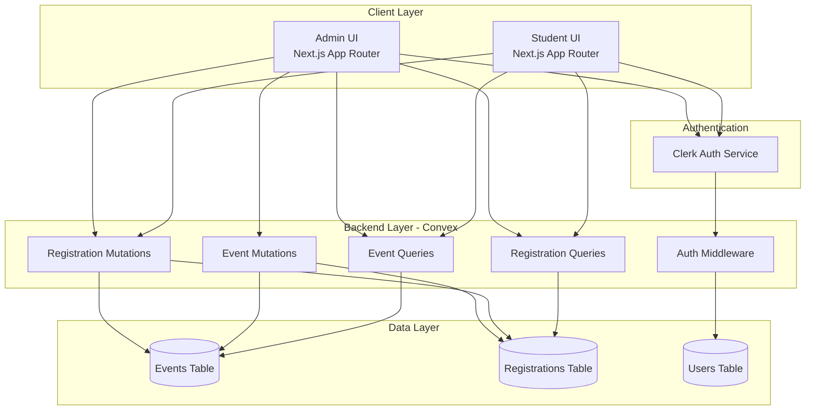

# Design Document: Event Registration System

## Overview

The Event Registration System is a full-stack application built on Next.js 16 with Convex backend, providing real-time event management and registration capabilities for IILM University's cultural fest. The system implements a clear separation between student and admin roles, with students able to browse and register for events, while admins manage the entire event lifecycle and monitor registrations.

The architecture leverages Convex's real-time reactivity to ensure immediate propagation of capacity changes across all connected clients, preventing race conditions in registration and providing instant feedback to users. Authentication and authorization are handled through Clerk, integrated with Convex for seamless role-based access control.

## Architecture

### High-Level Architecture



### Technology Stack Integration

- **Frontend**: Next.js 16 App Router with TypeScript, using server components by default and client components where interactivity is needed
- **Backend**: Convex functions (queries and mutations) with built-in real-time subscriptions
- **Authentication**: Clerk provides JWT tokens, Convex validates tokens and extracts role information
- **UI Components**: shadcn/ui components built on Radix UI primitives, styled with Tailwind CSS
- **State Management**: Convex handles all data fetching and real-time updates, eliminating need for separate state management
- **Validation**: Zod schemas for both client-side and server-side validation

### Feature Organization

Following the project's feature-based architecture:

```
src/features/
├── events/
│   ├── components/
│   │   ├── EventCard.tsx
│   │   ├── EventList.tsx
│   │   ├── EventFilters.tsx
│   │   └── EventForm.tsx (admin)
│   ├── hooks/
│   │   ├── useEvents.ts
│   │   └── useEventRegistration.ts
│   └── lib/
│       └── validation.ts
├── registrations/
│   ├── components/
│   │   ├── RegistrationList.tsx
│   │   ├── RegistrationCard.tsx
│   │   └── RegistrationStatus.tsx
│   └── hooks/
│       └── useRegistrations.ts
└── admin/
    ├── components/
    │   ├── AdminDashboard.tsx
    │   ├── EventManagement.tsx
    │   ├── RegistrationManagement.tsx
    │   └── ExportButton.tsx
    └── hooks/
        └── useAdminData.ts
```

## Components and Interfaces

### Data Models

#### Event Schema (Convex)

```typescript
// convex/schema.ts
import { defineSchema, defineTable } from "convex/server";
import { v } from "convex/values";

export default defineSchema({
  events: defineTable({
    name: v.string(),
    description: v.string(),
    category: v.union(
      v.literal("Music"),
      v.literal("Dance"),
      v.literal("Drama"),
      v.literal("Art"),
      v.literal("Sports"),
      v.literal("Technical"),
      v.literal("Literary"),
      v.literal("Other")
    ),
    date: v.string(), // ISO 8601 date string
    time: v.string(), // HH:MM format
    venue: v.string(),
    capacity: v.number(),
    registeredCount: v.number(), // Denormalized for performance
    createdBy: v.id("users"),
    createdAt: v.number(),
    updatedAt: v.number(),
  })
    .index("by_category", ["category"])
    .index("by_date", ["date"])
    .searchIndex("search_events", {
      searchField: "name",
      filterFields: ["category"],
    }),

  registrations: defineTable({
    userId: v.id("users"),
    eventId: v.id("events"),
    status: v.union(
      v.literal("pending"),
      v.literal("confirmed"),
      v.literal("cancelled")
    ),
    registeredAt: v.number(),
    updatedAt: v.number(),
  })
    .index("by_user", ["userId"])
    .index("by_event", ["eventId"])
    .index("by_status", ["status"])
    .index("by_user_and_event", ["userId", "eventId"]),

  users: defineTable({
    clerkId: v.string(),
    email: v.string(),
    name: v.string(),
    role: v.union(v.literal("student"), v.literal("admin")),
    createdAt: v.number(),
  })
    .index("by_clerk_id", ["clerkId"])
    .index("by_role", ["role"]),
});
```

#### TypeScript Interfaces (Client)

```typescript
// src/features/events/types.ts
export type EventCategory =
  | "Music"
  | "Dance"
  | "Drama"
  | "Art"
  | "Sports"
  | "Technical"
  | "Literary"
  | "Other";

export type RegistrationStatus = "pending" | "confirmed" | "cancelled";

export interface Event {
  _id: string;
  name: string;
  description: string;
  category: EventCategory;
  date: string;
  time: string;
  venue: string;
  capacity: number;
  registeredCount: number;
  availableSpots: number; // Computed: capacity - registeredCount
  isFull: boolean; // Computed: registeredCount >= capacity
  createdBy: string;
  createdAt: number;
  updatedAt: number;
}

export interface Registration {
  _id: string;
  userId: string;
  eventId: string;
  status: RegistrationStatus;
  registeredAt: number;
  updatedAt: number;
  event?: Event; // Populated via join
  user?: User; // Populated via join
}

export interface User {
  _id: string;
  clerkId: string;
  email: string;
  name: string;
  role: "student" | "admin";
  createdAt: number;
}
```

### Validation Schemas

```typescript
// src/features/events/lib/validation.ts
import { z } from "zod";

export const eventFormSchema = z.object({
  name: z.string().min(3, "Name must be at least 3 characters")
    .max(100, "Name must not exceed 100 characters"),
  description: z.string().min(10, "Description must be at least 10 characters")
    .max(1000, "Description must not exceed 1000 characters"),
  category: z.enum([
    "Music",
    "Dance",
    "Drama",
    "Art",
    "Sports",
    "Technical",
    "Literary",
    "Other",
  ]),
  date: z.string().refine((date) => {
    const eventDate = new Date(date);
    const today = new Date();
    today.setHours(0, 0, 0, 0);
    return eventDate >= today;
  }, "Event date cannot be in the past"),
  time: z.string().regex(/^([0-1]?[0-9]|2[0-3]):[0-5][0-9]$/, "Invalid time format (HH:MM)"),
  venue: z.string().min(3, "Venue must be at least 3 characters"),
  capacity: z.number().int().positive("Capacity must be a positive integer"),
});

export type EventFormData = z.infer<typeof eventFormSchema>;
```

### Core Components

#### Event Queries (Convex)

```typescript
// convex/events.ts
import { query } from "./_generated/server";
import { v } from "convex/values";

// Get all published events with computed fields
export const list = query({
  args: {
    category: v.optional(v.string()),
    searchQuery: v.optional(v.string()),
  },
  handler: async (ctx, args) => {
    let events;

    if (args.searchQuery) {
      events = await ctx.db
        .query("events")
        .withSearchIndex("search_events", (q) =>
          q.search("name", args.searchQuery!)
            .eq("category", args.category)
        )
        .collect();
    } else if (args.category) {
      events = await ctx.db
        .query("events")
        .withIndex("by_category", (q) => q.eq("category", args.category))
        .collect();
    } else {
      events = await ctx.db.query("events").collect();
    }

    // Add computed fields
    return events.map((event) => ({
      ...event,
      availableSpots: event.capacity - event.registeredCount,
      isFull: event.registeredCount >= event.capacity,
    }));
  },
});

// Get single event by ID
export const getById = query({
  args: { eventId: v.id("events") },
  handler: async (ctx, args) => {
    const event = await ctx.db.get(args.eventId);
    if (!event) return null;

    return {
      ...event,
      availableSpots: event.capacity - event.registeredCount,
      isFull: event.registeredCount >= event.capacity,
    };
  },
});
```

#### Event Mutations (Convex)

```typescript
// convex/events.ts (continued)
import { mutation } from "./_generated/server";

// Create new event (admin only)
export const create = mutation({
  args: {
    name: v.string(),
    description: v.string(),
    category: v.string(),
    date: v.string(),
    time: v.string(),
    venue: v.string(),
    capacity: v.number(),
  },
  handler: async (ctx, args) => {
    const identity = await ctx.auth.getUserIdentity();
    if (!identity) throw new Error("Unauthenticated");

    const user = await ctx.db
      .query("users")
      .withIndex("by_clerk_id", (q) => q.eq("clerkId", identity.subject))
      .unique();

    if (!user || user.role !== "admin") {
      throw new Error("Unauthorized: Admin access required");
    }

    // Validation happens on client, but double-check critical fields
    if (args.capacity <= 0) {
      throw new Error("Capacity must be positive");
    }

    const now = Date.now();
    return await ctx.db.insert("events", {
      ...args,
      registeredCount: 0,
      createdBy: user._id,
      createdAt: now,
      updatedAt: now,
    });
  },
});

// Update event (admin only)
export const update = mutation({
  args: {
    eventId: v.id("events"),
    name: v.string(),
    description: v.string(),
    category: v.string(),
    date: v.string(),
    time: v.string(),
    venue: v.string(),
    capacity: v.number(),
  },
  handler: async (ctx, args) => {
    const identity = await ctx.auth.getUserIdentity();
    if (!identity) throw new Error("Unauthenticated");

    const user = await ctx.db
      .query("users")
      .withIndex("by_clerk_id", (q) => q.eq("clerkId", identity.subject))
      .unique();

    if (!user || user.role !== "admin") {
      throw new Error("Unauthorized: Admin access required");
    }

    const { eventId, ...updates } = args;
    await ctx.db.patch(eventId, {
      ...updates,
      updatedAt: Date.now(),
    });
  },
});

// Delete event (admin only)
export const remove = mutation({
  args: { eventId: v.id("events") },
  handler: async (ctx, args) => {
    const identity = await ctx.auth.getUserIdentity();
    if (!identity) throw new Error("Unauthenticated");

    const user = await ctx.db
      .query("users")
      .withIndex("by_clerk_id", (q) => q.eq("clerkId", identity.subject))
      .unique();

    if (!user || user.role !== "admin") {
      throw new Error("Unauthorized: Admin access required");
    }

    // Cancel all registrations for this event
    const registrations = await ctx.db
      .query("registrations")
      .withIndex("by_event", (q) => q.eq("eventId", args.eventId))
      .collect();

    for (const registration of registrations) {
      await ctx.db.patch(registration._id, {
        status: "cancelled",
        updatedAt: Date.now(),
      });
    }

    await ctx.db.delete(args.eventId);
  },
});
```

#### Registration Mutations (Convex)

```typescript
// convex/registrations.ts
import { mutation, query } from "./_generated/server";
import { v } from "convex/values";

// Register for an event
export const register = mutation({
  args: { eventId: v.id("events") },
  handler: async (ctx, args) => {
    const identity = await ctx.auth.getUserIdentity();
    if (!identity) throw new Error("Unauthenticated");

    const user = await ctx.db
      .query("users")
      .withIndex("by_clerk_id", (q) => q.eq("clerkId", identity.subject))
      .unique();

    if (!user) throw new Error("User not found");

    // Check for existing registration
    const existing = await ctx.db
      .query("registrations")
      .withIndex("by_user_and_event", (q) =>
        q.eq("userId", user._id).eq("eventId", args.eventId)
      )
      .filter((q) => q.neq(q.field("status"), "cancelled"))
      .unique();

    if (existing) {
      throw new Error("Already registered for this event");
    }

    // Check event capacity
    const event = await ctx.db.get(args.eventId);
    if (!event) throw new Error("Event not found");

    if (event.registeredCount >= event.capacity) {
      throw new Error("Event is full");
    }

    // Create registration and update event count atomically
    const now = Date.now();
    const registrationId = await ctx.db.insert("registrations", {
      userId: user._id,
      eventId: args.eventId,
      status: "pending",
      registeredAt: now,
      updatedAt: now,
    });

    await ctx.db.patch(args.eventId, {
      registeredCount: event.registeredCount + 1,
      updatedAt: now,
    });

    return registrationId;
  },
});

// Cancel registration
export const cancel = mutation({
  args: { registrationId: v.id("registrations") },
  handler: async (ctx, args) => {
    const identity = await ctx.auth.getUserIdentity();
    if (!identity) throw new Error("Unauthenticated");

    const user = await ctx.db
      .query("users")
      .withIndex("by_clerk_id", (q) => q.eq("clerkId", identity.subject))
      .unique();

    if (!user) throw new Error("User not found");

    const registration = await ctx.db.get(args.registrationId);
    if (!registration) throw new Error("Registration not found");

    // Verify ownership (students can only cancel their own)
    if (user.role !== "admin" && registration.userId !== user._id) {
      throw new Error("Unauthorized");
    }

    if (registration.status === "cancelled") {
      throw new Error("Registration already cancelled");
    }

    // Update registration and event count atomically
    const now = Date.now();
    await ctx.db.patch(args.registrationId, {
      status: "cancelled",
      updatedAt: now,
    });

    const event = await ctx.db.get(registration.eventId);
    if (event) {
      await ctx.db.patch(registration.eventId, {
        registeredCount: Math.max(0, event.registeredCount - 1),
        updatedAt: now,
      });
    }
  },
});

// Get user's registrations
export const listByUser = query({
  handler: async (ctx) => {
    const identity = await ctx.auth.getUserIdentity();
    if (!identity) return [];

    const user = await ctx.db
      .query("users")
      .withIndex("by_clerk_id", (q) => q.eq("clerkId", identity.subject))
      .unique();

    if (!user) return [];

    const registrations = await ctx.db
      .query("registrations")
      .withIndex("by_user", (q) => q.eq("userId", user._id))
      .collect();

    // Join with events
    return Promise.all(
      registrations.map(async (reg) => {
        const event = await ctx.db.get(reg.eventId);
        return { ...reg, event };
      })
    );
  },
});

// Get all registrations (admin only)
export const listAll = query({
  args: {
    eventId: v.optional(v.id("events")),
    status: v.optional(v.string()),
  },
  handler: async (ctx, args) => {
    const identity = await ctx.auth.getUserIdentity();
    if (!identity) throw new Error("Unauthenticated");

    const user = await ctx.db
      .query("users")
      .withIndex("by_clerk_id", (q) => q.eq("clerkId", identity.subject))
      .unique();

    if (!user || user.role !== "admin") {
      throw new Error("Unauthorized: Admin access required");
    }

    let registrations;

    if (args.eventId) {
      registrations = await ctx.db
        .query("registrations")
        .withIndex("by_event", (q) => q.eq("eventId", args.eventId))
        .collect();
    } else if (args.status) {
      registrations = await ctx.db
        .query("registrations")
        .withIndex("by_status", (q) => q.eq("status", args.status))
        .collect();
    } else {
      registrations = await ctx.db.query("registrations").collect();
    }

    // Join with events and users
    return Promise.all(
      registrations.map(async (reg) => {
        const event = await ctx.db.get(reg.eventId);
        const regUser = await ctx.db.get(reg.userId);
        return { ...reg, event, user: regUser };
      })
    );
  },
});

// Update registration status (admin only)
export const updateStatus = mutation({
  args: {
    registrationId: v.id("registrations"),
    status: v.union(
      v.literal("pending"),
      v.literal("confirmed"),
      v.literal("cancelled")
    ),
  },
  handler: async (ctx, args) => {
    const identity = await ctx.auth.getUserIdentity();
    if (!identity) throw new Error("Unauthenticated");

    const user = await ctx.db
      .query("users")
      .withIndex("by_clerk_id", (q) => q.eq("clerkId", identity.subject))
      .unique();

    if (!user || user.role !== "admin") {
      throw new Error("Unauthorized: Admin access required");
    }

    const registration = await ctx.db.get(args.registrationId);
    if (!registration) throw new Error("Registration not found");

    // Handle capacity changes when transitioning to/from cancelled
    const event = await ctx.db.get(registration.eventId);
    if (event) {
      const now = Date.now();
      
      if (registration.status !== "cancelled" && args.status === "cancelled") {
        // Cancelling: decrement count
        await ctx.db.patch(registration.eventId, {
          registeredCount: Math.max(0, event.registeredCount - 1),
          updatedAt: now,
        });
      } else if (registration.status === "cancelled" && args.status !== "cancelled") {
        // Un-cancelling: increment count
        if (event.registeredCount >= event.capacity) {
          throw new Error("Cannot un-cancel: event is full");
        }
        await ctx.db.patch(registration.eventId, {
          registeredCount: event.registeredCount + 1,
          updatedAt: now,
        });
      }
    }

    await ctx.db.patch(args.registrationId, {
      status: args.status,
      updatedAt: Date.now(),
    });
  },
});
```

#### Data Export (Convex)

```typescript
// convex/admin.ts
import { query } from "./_generated/server";
import { v } from "convex/values";

export const exportRegistrations = query({
  args: {
    eventId: v.optional(v.id("events")),
    status: v.optional(v.string()),
  },
  handler: async (ctx, args) => {
    const identity = await ctx.auth.getUserIdentity();
    if (!identity) throw new Error("Unauthenticated");

    const user = await ctx.db
      .query("users")
      .withIndex("by_clerk_id", (q) => q.eq("clerkId", identity.subject))
      .unique();

    if (!user || user.role !== "admin") {
      throw new Error("Unauthorized: Admin access required");
    }

    // Get filtered registrations
    let registrations;
    if (args.eventId) {
      registrations = await ctx.db
        .query("registrations")
        .withIndex("by_event", (q) => q.eq("eventId", args.eventId))
        .collect();
    } else if (args.status) {
      registrations = await ctx.db
        .query("registrations")
        .withIndex("by_status", (q) => q.eq("status", args.status))
        .collect();
    } else {
      registrations = await ctx.db.query("registrations").collect();
    }

    // Join with events and users, format for CSV
    const exportData = await Promise.all(
      registrations.map(async (reg) => {
        const event = await ctx.db.get(reg.eventId);
        const regUser = await ctx.db.get(reg.userId);
        
        return {
          studentName: regUser?.name || "Unknown",
          studentEmail: regUser?.email || "Unknown",
          eventName: event?.name || "Unknown",
          eventCategory: event?.category || "Unknown",
          registrationStatus: reg.status,
          registeredAt: new Date(reg.registeredAt).toISOString(),
        };
      })
    );

    return exportData;
  },
});
```

### Client Components

#### Event List Component

```typescript
// src/features/events/components/EventList.tsx
"use client";

import { useQuery } from "convex/react";
import { api } from "@/convex/_generated/api";
import { EventCard } from "./EventCard";
import { EventFilters } from "./EventFilters";
import { useState } from "react";
import type { EventCategory } from "../types";

export function EventList() {
  const [category, setCategory] = useState<EventCategory | undefined>();
  const [searchQuery, setSearchQuery] = useState("");

  const events = useQuery(api.events.list, { category, searchQuery });

  if (events === undefined) {
    return <div>Loading events...</div>;
  }

  return (
    <div className="space-y-6">
      <EventFilters
        category={category}
        searchQuery={searchQuery}
        onCategoryChange={setCategory}
        onSearchChange={setSearchQuery}
      />
      
      {events.length === 0 ? (
        <p className="text-center text-muted-foreground">No events found</p>
      ) : (
        <div className="grid gap-4 md:grid-cols-2 lg:grid-cols-3">
          {events.map((event) => (
            <EventCard key={event._id} event={event} />
          ))}
        </div>
      )}
    </div>
  );
}
```

#### Event Registration Hook

```typescript
// src/features/events/hooks/useEventRegistration.ts
"use client";

import { useMutation } from "convex/react";
import { api } from "@/convex/_generated/api";
import { useToast } from "@/hooks/use-toast";
import type { Id } from "@/convex/_generated/dataModel";

export function useEventRegistration() {
  const registerMutation = useMutation(api.registrations.register);
  const cancelMutation = useMutation(api.registrations.cancel);
  const { toast } = useToast();

  const register = async (eventId: Id<"events">) => {
    try {
      await registerMutation({ eventId });
      toast({
        title: "Registration successful",
        description: "You've been registered for this event",
      });
    } catch (error) {
      toast({
        title: "Registration failed",
        description: error instanceof Error ? error.message : "Unknown error",
        variant: "destructive",
      });
    }
  };

  const cancel = async (registrationId: Id<"registrations">) => {
    try {
      await cancelMutation({ registrationId });
      toast({
        title: "Registration cancelled",
        description: "Your registration has been cancelled",
      });
    } catch (error) {
      toast({
        title: "Cancellation failed",
        description: error instanceof Error ? error.message : "Unknown error",
        variant: "destructive",
      });
    }
  };

  return { register, cancel };
}
```

## Data Models

See "Components and Interfaces" section above for complete schema definitions.

Key design decisions:
- **Denormalized `registeredCount`**: Stored on events table for fast capacity checks without counting registrations
- **Composite index on `userId` and `eventId`**: Enables fast duplicate registration checks
- **Search index on event names**: Supports efficient text search with category filtering
- **ISO 8601 date strings**: Ensures consistent date handling across timezones
- **Atomic updates**: Registration and capacity updates happen in same transaction to prevent race conditions


## Correctness Properties

A property is a characteristic or behavior that should hold true across all valid executions of a system—essentially, a formal statement about what the system should do. Properties serve as the bridge between human-readable specifications and machine-verifiable correctness guarantees.

### Property 1: Event Display Contains Required Fields

*For any* event displayed in the UI, the rendered output should contain the event name, category, date, time, venue, and available capacity.

**Validates: Requirements 1.2**

### Property 2: Category Filtering Returns Only Matching Events

*For any* category filter applied to a set of events, all returned events should have a category field that matches the selected category.

**Validates: Requirements 1.3, 9.4**

### Property 3: Search Returns Matching Events

*For any* search keyword applied to a set of events, all returned events should have the keyword present in either the name or description field.

**Validates: Requirements 1.4**

### Property 4: Full Events Display Correct UI State

*For any* event where registeredCount >= capacity, the UI should display a "Full" indicator and the registration button should be disabled.

**Validates: Requirements 1.5**

### Property 5: Successful Registration Creates Pending Status

*For any* available event (registeredCount < capacity), when a student registers, a registration record should be created with status "pending".

**Validates: Requirements 2.1**

### Property 6: Registration Respects Capacity Limits

*For any* event where registeredCount >= capacity, attempting to register should be rejected with an error message.

**Validates: Requirements 2.2, 2.3**

### Property 7: Registration Operations Maintain Capacity Invariant

*For any* event, the following invariant should hold:
- After a successful registration, registeredCount increases by exactly 1
- After a successful cancellation, registeredCount decreases by exactly 1
- registeredCount should never exceed capacity
- registeredCount should never be negative

**Validates: Requirements 2.4, 3.4**

### Property 8: Duplicate Registration Prevention

*For any* student and event pair, if an active registration (status != "cancelled") already exists, attempting to register again should be rejected with an error message.

**Validates: Requirements 2.5**

### Property 9: Registration Display Contains Required Fields

*For any* registration displayed in the UI, the rendered output should contain registration status, event name, date, time, and venue.

**Validates: Requirements 3.2**

### Property 10: Registration Cancellation Updates Status

*For any* active registration (status != "cancelled"), when cancelled, the registration status should be updated to "cancelled".

**Validates: Requirements 3.3**

### Property 11: Cancelled Registration Cannot Be Re-cancelled

*For any* registration with status "cancelled", attempting to cancel it again should be rejected with an error message.

**Validates: Requirements 3.5**

### Property 12: Event Creation Requires All Fields

*For any* event creation attempt, if any required field (name, description, date, time, venue, capacity, category) is missing or invalid, the creation should be rejected with a specific error message indicating which field is invalid.

**Validates: Requirements 4.1, 4.2**

### Property 13: Event Updates Preserve Registrations

*For any* event with existing registrations, updating the event's details (name, description, date, time, venue, category) should not modify, delete, or cancel any of the existing registrations.

**Validates: Requirements 4.3**

### Property 14: Event Deletion Cancels All Registrations

*For any* event with registrations, when the event is deleted, all associated registrations should have their status updated to "cancelled".

**Validates: Requirements 4.4**

### Property 15: Admin Registration Display Contains Required Fields

*For any* registration displayed in the admin dashboard, the rendered output should contain student name, event name, registration status, and timestamp.

**Validates: Requirements 5.2**

### Property 16: Admin Event Filter Returns Only Matching Registrations

*For any* event filter applied to registrations in the admin dashboard, all returned registrations should have an eventId that matches the selected event.

**Validates: Requirements 5.3**

### Property 17: Admin Status Filter Returns Only Matching Registrations

*For any* status filter applied to registrations in the admin dashboard, all returned registrations should have a status field that matches the selected status.

**Validates: Requirements 5.4**

### Property 18: Registration Status Transitions Are Valid

*For any* registration status update, the system should validate that the transition is valid:
- From "pending" to "confirmed" or "cancelled" is valid
- From "confirmed" to "cancelled" is valid
- From "cancelled" to "pending" or "confirmed" requires capacity check
- Invalid transitions should be rejected with an error message

**Validates: Requirements 5.5**

### Property 19: Non-Admin Users Cannot Perform Admin Operations

*For any* user without admin role, attempting to perform admin operations (create event, update event, delete event, update registration status, export data) should be rejected with an authorization error.

**Validates: Requirements 7.2**

### Property 20: Export Contains Required Fields

*For any* registration included in an export, the CSV output should contain student name, email, event name, category, status, and timestamp.

**Validates: Requirements 8.2**

### Property 21: Export Respects Filters

*For any* filter applied before export (event filter or status filter), the exported data should contain only registrations that match the filter criteria.

**Validates: Requirements 8.3**

### Property 22: Event Category Grouping

*For any* set of events displayed with grouping enabled, events should be organized such that all events with the same category appear together.

**Validates: Requirements 9.3**

### Property 23: Capacity Validation

*For any* event creation or update, if the capacity value is not a positive integer, the operation should be rejected with a specific error message.

**Validates: Requirements 10.1**

### Property 24: Date Validation

*For any* event creation or update, if the event date is in the past, the operation should be rejected with a specific error message.

**Validates: Requirements 10.2**

### Property 25: Name Length Validation

*For any* event creation or update, if the name is less than 3 characters or more than 100 characters, the operation should be rejected with a specific error message.

**Validates: Requirements 10.3**

### Property 26: Description Length Validation

*For any* event creation or update, if the description is less than 10 characters or more than 1000 characters, the operation should be rejected with a specific error message.

**Validates: Requirements 10.4**

### Property 27: Validation Error Messages Are Specific

*For any* validation failure, the error message should specifically indicate which field failed validation and why, rather than returning a generic error message.

**Validates: Requirements 10.5**

## Error Handling

### Client-Side Error Handling

**Form Validation Errors**:
- Display inline error messages below form fields using Zod validation
- Prevent form submission until all validation errors are resolved
- Use toast notifications for submission errors from the server

**Network Errors**:
- Display toast notifications for connection failures
- Implement retry logic for transient failures
- Show loading states during async operations

**Authorization Errors**:
- Redirect to login page for unauthenticated users
- Display "Access Denied" message for unauthorized operations
- Provide clear messaging about required permissions

### Server-Side Error Handling

**Convex Mutations**:
- Throw descriptive errors that can be displayed to users
- Use specific error messages for different failure modes
- Log errors for debugging while returning safe messages to clients

**Race Condition Prevention**:
- Use Convex's transactional guarantees for atomic operations
- Check capacity immediately before registration in same transaction
- Use optimistic locking for concurrent updates

**Data Validation**:
- Validate all inputs on server even if client validates
- Return specific field-level errors for validation failures
- Sanitize error messages to avoid exposing sensitive information

### Error Recovery

**Registration Failures**:
- Allow users to retry registration after fixing issues
- Preserve form data when validation fails
- Provide alternative actions (e.g., "Join Waitlist" for full events)

**Capacity Conflicts**:
- Display real-time capacity updates to prevent conflicts
- Show clear messaging when event becomes full during registration
- Suggest similar events when desired event is full

## Testing Strategy

### Dual Testing Approach

The system will use both unit testing and property-based testing to ensure comprehensive coverage:

**Unit Tests**: Verify specific examples, edge cases, and error conditions
- Specific registration scenarios (first registration, last spot, etc.)
- Edge cases (empty event lists, single event, etc.)
- Error conditions (network failures, validation errors, etc.)
- Integration points between components

**Property Tests**: Verify universal properties across all inputs
- Run minimum 100 iterations per property test
- Use random data generation for comprehensive coverage
- Test invariants that must hold for all valid inputs
- Validate business rules across the input space

### Property-Based Testing Configuration

**Testing Library**: Use `fast-check` for TypeScript property-based testing

**Test Structure**:
```typescript
import fc from "fast-check";
import { describe, it, expect } from "vitest";

describe("Event Registration System", () => {
  it("Property 7: Registration operations maintain capacity invariant", () => {
    // Feature: event-registration-system, Property 7: Registration operations maintain capacity invariant
    fc.assert(
      fc.property(
        fc.record({
          capacity: fc.integer({ min: 1, max: 100 }),
          registeredCount: fc.integer({ min: 0, max: 100 }),
        }),
        (event) => {
          // Test registration increases count by 1
          // Test cancellation decreases count by 1
          // Test count never exceeds capacity
          // Test count never goes negative
        }
      ),
      { numRuns: 100 }
    );
  });
});
```

**Tag Format**: Each property test must include a comment:
```typescript
// Feature: event-registration-system, Property {number}: {property_text}
```

### Test Coverage Requirements

**Backend (Convex Functions)**:
- Unit tests for each query and mutation
- Property tests for all 27 correctness properties
- Integration tests for multi-step workflows
- Mock Clerk authentication for testing

**Frontend (React Components)**:
- Unit tests for component rendering with various props
- Property tests for UI state consistency
- Integration tests for user workflows
- Mock Convex queries/mutations for testing

**Validation**:
- Unit tests for each validation rule
- Property tests for validation consistency
- Test both client and server validation

### Testing Tools

- **Test Runner**: Vitest
- **Property Testing**: fast-check
- **React Testing**: React Testing Library
- **Mocking**: Vitest mocks for Convex and Clerk
- **Coverage**: Vitest coverage reports (target: 80%+ coverage)

### Continuous Integration

- Run all tests on every commit
- Block merges if tests fail
- Generate coverage reports
- Run property tests with increased iterations (1000+) in CI

