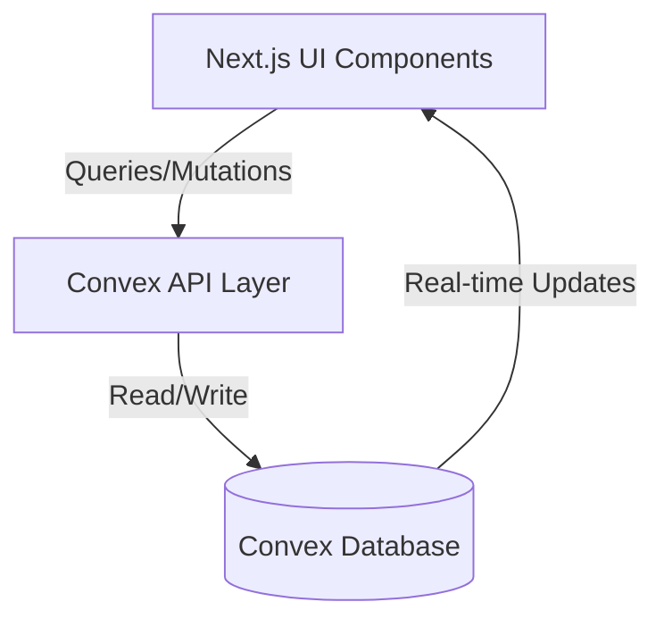

# Design Document: Event Registration System

## Overview

The Event Registration System is built on Next.js with Convex as the backend. The system provides a complete solution for managing user registrations and event sign-ups for the Mosaic cultural fest. The architecture follows a client-server model where Next.js handles the UI layer and Convex manages data persistence, queries, and mutations with built-in real-time updates.

## Architecture

### High-Level Architecture



### Technology Stack

- **Frontend**: Next.js 14+ with TypeScript, React Server Components
- **Backend**: Convex (serverless backend with real-time database)
- **UI Components**: shadcn/ui components
- **Validation**: Zod for schema validation
- **State Management**: Convex's built-in reactive queries

### Key Architectural Decisions

1. **Convex for Backend**: Leverages Convex's built-in features for real-time updates, optimistic updates, and transactional consistency
2. **Server-Side Validation**: All validation happens in Convex mutations to ensure data integrity
3. **Optimistic UI Updates**: Use Convex's optimistic update patterns for responsive user experience
4. **Type Safety**: End-to-end TypeScript with Convex's generated types

## Components and Interfaces

### Data Schema (Convex)

#### Users Table
```typescript
// convex/schema.ts
users: defineTable({
  name: v.string(),
  email: v.string(),
  phoneNumber: v.string(),
  createdAt: v.number(),
}).index("by_email", ["email"])
```

#### Events Table
```typescript
// convex/schema.ts
events: defineTable({
  name: v.string(),
  description: v.string(),
  date: v.number(), // Unix timestamp
  time: v.string(),
  location: v.string(),
  capacity: v.number(),
  registeredCount: v.number(),
  createdAt: v.number(),
}).index("by_date", ["date"])
```

#### Registrations Table
```typescript
// convex/schema.ts
registrations: defineTable({
  userId: v.id("users"),
  eventId: v.id("events"),
  registeredAt: v.number(),
})
  .index("by_user", ["userId"])
  .index("by_event", ["eventId"])
  .index("by_user_and_event", ["userId", "eventId"])
```

### Convex Mutations

#### createUser
```typescript
// convex/users.ts
export const createUser = mutation({
  args: {
    name: v.string(),
    email: v.string(),
    phoneNumber: v.string(),
  },
  handler: async (ctx, args) => {
    // Validate email format
    // Check for existing email
    // Create user record
    // Return user ID
  }
})
```

#### registerForEvent
```typescript
// convex/registrations.ts
export const registerForEvent = mutation({
  args: {
    userId: v.id("users"),
    eventId: v.id("events"),
  },
  handler: async (ctx, args) => {
    // Check event capacity
    // Check for duplicate registration
    // Create registration record
    // Increment event registeredCount
    // Return registration ID
  }
})
```

#### cancelRegistration
```typescript
// convex/registrations.ts
export const cancelRegistration = mutation({
  args: {
    userId: v.id("users"),
    eventId: v.id("events"),
  },
  handler: async (ctx, args) => {
    // Find registration record
    // Delete registration
    // Decrement event registeredCount
  }
})
```

### Convex Queries

#### listEvents
```typescript
// convex/events.ts
export const listEvents = query({
  handler: async (ctx) => {
    // Fetch all events ordered by date
    // Return events with capacity info
  }
})
```

#### getUserRegistrations
```typescript
// convex/registrations.ts
export const getUserRegistrations = query({
  args: { userId: v.id("users") },
  handler: async (ctx, args) => {
    // Fetch all registrations for user
    // Join with events table
    // Return event details
  }
})
```

#### getUserProfile
```typescript
// convex/users.ts
export const getUserProfile = query({
  args: { userId: v.id("users") },
  handler: async (ctx, args) => {
    // Fetch user by ID
    // Return user profile
  }
})
```

### UI Components

#### RegistrationForm Component
- Collects user information (name, email, phone)
- Validates input on client side
- Calls createUser mutation
- Handles success/error states

#### EventList Component
- Displays all available events
- Shows capacity information
- Indicates full events
- Provides registration buttons

#### EventCard Component
- Displays individual event details
- Shows registration status
- Handles register/cancel actions
- Updates optimistically

#### UserDashboard Component
- Shows user profile
- Lists user's registered events
- Provides cancellation functionality

## Data Models

### User Model
```typescript
type User = {
  _id: Id<"users">;
  name: string;
  email: string;
  phoneNumber: string;
  createdAt: number;
}
```

### Event Model
```typescript
type Event = {
  _id: Id<"events">;
  name: string;
  description: string;
  date: number;
  time: string;
  location: string;
  capacity: number;
  registeredCount: number;
  createdAt: number;
}
```

### Registration Model
```typescript
type Registration = {
  _id: Id<"registrations">;
  userId: Id<"users">;
  eventId: Id<"events">;
  registeredAt: number;
}
```

### Validation Schemas

```typescript
// Email validation
const emailRegex = /^[^\s@]+@[^\s@]+\.[^\s@]+$/;

// Phone validation (flexible format)
const phoneRegex = /^[\d\s\-\+\(\)]+$/;

// Validation functions
function isValidEmail(email: string): boolean {
  return emailRegex.test(email) && email.length > 0;
}

function isValidPhone(phone: string): boolean {
  return phoneRegex.test(phone) && phone.length >= 10;
}

function isNonEmpty(value: string): boolean {
  return value.trim().length > 0;
}
```

## Correctness Properties

*A property is a characteristic or behavior that should hold true across all valid executions of a system—essentially, a formal statement about what the system should do. Properties serve as the bridge between human-readable specifications and machine-verifiable correctness guarantees.*


### Property 1: Valid User Creation
*For any* valid user data (non-empty name, valid email format, valid phone number), creating a user should succeed and return a user ID.
**Validates: Requirements 1.1**

### Property 2: Duplicate Email Rejection
*For any* email address, if a user with that email already exists, attempting to create another user with the same email should be rejected with an error.
**Validates: Requirements 1.2**

### Property 3: Invalid Email Rejection
*For any* string that does not match valid email format (missing @, missing domain, etc.), attempting to create a user with that email should be rejected with a validation error.
**Validates: Requirements 1.3, 5.1**

### Property 4: User Data Persistence Round-Trip
*For any* valid user data, creating a user then retrieving that user's profile should return data equivalent to what was originally provided.
**Validates: Requirements 1.4, 7.1, 7.3**

### Property 5: Empty Field Rejection
*For any* user registration data where at least one required field (name, email, or phone) is empty or contains only whitespace, the registration should be rejected.
**Validates: Requirements 1.5**

### Property 6: Event Listing Completeness
*For any* set of events in the database, querying the event list should return all events with complete details (name, description, date, time, location, capacity, registeredCount).
**Validates: Requirements 2.1**

### Property 7: Registration Count Invariant
*For any* event at any point in time, the event's registeredCount field should equal the actual number of registration records for that event.
**Validates: Requirements 2.2, 3.4, 4.3**

### Property 8: Event Capacity Status Accuracy
*For any* event, the system should correctly indicate whether the event is full (registeredCount >= capacity) or has available spots (registeredCount < capacity).
**Validates: Requirements 2.3**

### Property 9: Event Chronological Ordering
*For any* set of events, the event list query should return events sorted in chronological order by date (and time for same-day events).
**Validates: Requirements 2.4**

### Property 10: Successful Registration Creation
*For any* user and event where the event has available capacity and the user is not already registered, creating a registration should succeed and create a Registration_Record.
**Validates: Requirements 3.1**

### Property 11: Capacity Limit Enforcement
*For any* event that has reached its capacity (registeredCount >= capacity), attempting to register an additional user should be rejected with an error.
**Validates: Requirements 3.2**

### Property 12: Duplicate Registration Prevention
*For any* user-event pair where a registration already exists, attempting to create a second registration for the same user-event pair should be rejected with an error.
**Validates: Requirements 3.3**

### Property 13: Registration Persistence Round-Trip
*For any* valid registration, creating a registration then querying for that user's registrations should include the newly created registration.
**Validates: Requirements 3.5**

### Property 14: User Registration Query Completeness
*For any* user with N registrations, querying that user's registrations should return exactly N event records.
**Validates: Requirements 4.1**

### Property 15: Registration Cancellation Removal
*For any* existing registration, canceling that registration should result in the Registration_Record no longer existing in the database.
**Validates: Requirements 4.2**

### Property 16: Capacity Restoration After Cancellation
*For any* event at full capacity, if a user cancels their registration, then another user should be able to successfully register for that event.
**Validates: Requirements 4.4**

### Property 17: Phone Number Validation
*For any* string containing invalid characters for phone numbers (letters, special symbols except +, -, (, ), spaces), attempting to create a user with that phone number should be rejected.
**Validates: Requirements 5.2**

### Property 18: Event Capacity Validation
*For any* event creation or update, if the capacity is not a positive integer (zero, negative, or non-integer), the operation should be rejected.
**Validates: Requirements 5.3**

### Property 19: Future Date Validation
*For any* event creation or update, if the event date is in the past, the operation should be rejected with a validation error.
**Validates: Requirements 5.4**

### Property 20: Concurrent Registration Correctness
*For any* event with capacity C and remaining spots R, if N users (where N > R) attempt to register concurrently, exactly R registrations should succeed and (N - R) should fail, with the final registeredCount equal to C.
**Validates: Requirements 6.1**

### Property 21: User Data Isolation
*For any* two different users A and B, querying user A's profile should never return user B's data, and querying user A's registrations should never return user B's registrations.
**Validates: Requirements 7.2**

## Error Handling

### Error Types

1. **ValidationError**: Input data fails validation rules
   - Invalid email format
   - Invalid phone format
   - Empty required fields
   - Invalid capacity values
   - Past event dates

2. **DuplicateError**: Attempting to create duplicate records
   - Email already exists
   - User already registered for event

3. **CapacityError**: Event capacity constraints violated
   - Event is full
   - Cannot register more users

4. **NotFoundError**: Requested resource doesn't exist
   - User ID not found
   - Event ID not found
   - Registration not found

5. **ConcurrencyError**: Race condition detected
   - Multiple simultaneous registrations for last spot

### Error Handling Strategy

**Validation Errors**:
- Validate all inputs in Convex mutations before database operations
- Return descriptive error messages to the client
- Client displays user-friendly error messages

**Capacity Errors**:
- Check capacity before creating registration
- Use Convex transactions to ensure atomic operations
- Return clear error when event is full

**Duplicate Errors**:
- Check for existing records before creation
- Use database indexes for efficient duplicate detection
- Return specific error indicating what duplicate was found

**Concurrency Handling**:
- Leverage Convex's built-in transaction support
- Use optimistic locking where appropriate
- Retry logic on the client for transient failures

**Error Response Format**:
```typescript
type ErrorResponse = {
  success: false;
  error: {
    type: "ValidationError" | "DuplicateError" | "CapacityError" | "NotFoundError" | "ConcurrencyError";
    message: string;
    field?: string; // For validation errors
  }
}
```

## Testing Strategy

### Dual Testing Approach

The system will use both unit tests and property-based tests to ensure comprehensive coverage:

**Unit Tests**:
- Specific examples demonstrating correct behavior
- Edge cases (empty events list, single user, etc.)
- Error conditions (invalid inputs, missing data)
- Integration between Convex mutations and queries
- UI component rendering and interactions

**Property-Based Tests**:
- Universal properties that hold for all inputs
- Comprehensive input coverage through randomization
- Minimum 100 iterations per property test
- Each property test references its design document property

### Property-Based Testing Configuration

**Testing Library**: We will use **fast-check** for TypeScript property-based testing.

**Test Configuration**:
- Minimum 100 iterations per property test
- Each test tagged with: `Feature: event-registration, Property N: [property text]`
- Tests run as part of the standard test suite

**Example Property Test Structure**:
```typescript
// Feature: event-registration, Property 4: User Data Persistence Round-Trip
test('user data round-trip preserves information', async () => {
  await fc.assert(
    fc.asyncProperty(
      fc.record({
        name: fc.string({ minLength: 1 }),
        email: fc.emailAddress(),
        phoneNumber: fc.string({ minLength: 10 })
      }),
      async (userData) => {
        const userId = await createUser(userData);
        const retrieved = await getUserProfile(userId);
        
        expect(retrieved.name).toBe(userData.name);
        expect(retrieved.email).toBe(userData.email);
        expect(retrieved.phoneNumber).toBe(userData.phoneNumber);
      }
    ),
    { numRuns: 100 }
  );
});
```

### Test Coverage Goals

- All 21 correctness properties implemented as property-based tests
- Unit tests for each Convex mutation and query
- Integration tests for complete user flows
- UI component tests for all user-facing components
- Error handling tests for all error types

### Testing Focus Areas

**Critical Paths**:
1. User registration flow (creation, validation, persistence)
2. Event registration flow (capacity checking, duplicate prevention)
3. Registration cancellation flow (removal, capacity restoration)
4. Concurrent registration handling

**Edge Cases**:
- Events with zero capacity
- Events with very large capacity
- Users with many registrations
- Empty event lists
- Simultaneous cancellation and registration

**Error Scenarios**:
- All validation error types
- Capacity exceeded scenarios
- Duplicate detection
- Concurrent access conflicts
